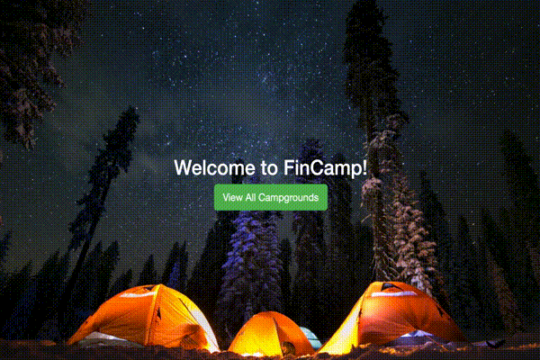

<h2 align="center">
  Welcome to FinCamp
</h2>

  A web application for camping fans, with a document database of campsites around Finland. Registred user are allowed to
  add new campsites, review them and leave comments. 

  

  

 
<h3 align="center">
  Technologies used in this Project
</h3>
<h4 align="center">
  Front-End
</h4>
<ul align="center">
  <li>JavaScript</li>
  <li>HTML</li>
  <li>CSS</li>
  <li>Bootstrap</li>
  <li>jQuerry</li>
</ul>
<h4 align="center">
  Back-End
</h4>
<ul align="center">
  <li>nodeJS</li>
  <li>Express</li>
  <li>PassportJS</li>
  <li>mongoDB</li>
</ul>

  

<h3 align="center">
  What I have learned.
</h3>
