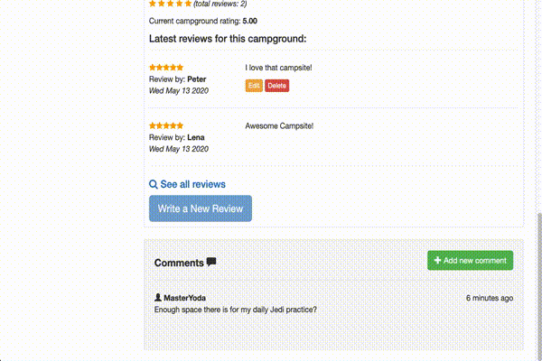

<h2 align="center">
  Welcome to FinCamp
</h2>

  A web application for camping fans, with a document database of campsites around Finland. Registred user are allowed to
  add new campsites, review them and leave comments. 

  

  

 
<h3 align="center">
  Technologies used in this Project
</h3>
<h4 align="center">
  Front-End
</h4>

JavaScript

HTML

CSS

Bootstrap

jQuerry

<h4 align="center">
  Back-End
</h4>

nodeJS

Express

PassportJS

mongoDB

  

<h2 align="center">
  Things I learned from this Project.
</h2>
<h3 align="center">RESTful Routes</h3>
<h3 align="center">CRUD</h3>

Create, read, update and delete comments, reviews and campgrounds.

  
  

 
<h3 align="center">User authentication</h3>

Only registred user's can add, edit or delte campgrounds, comments and reviews.

  

<h3 align="center">Fuzzy search</h3>

  

<h3 align="center">Permission management</h3>
<h3 align="center">Database management</h3>
<h3 align="center">DOM manipulation</h3>
 

 This project is still far from over. I want to add some other features and improve the user interface and experience.
  Thanks for taking the time to check out my first full stack project! 

